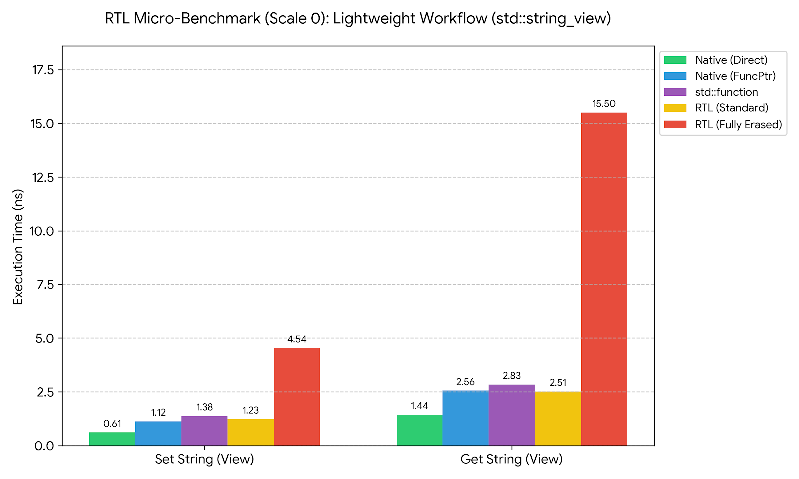
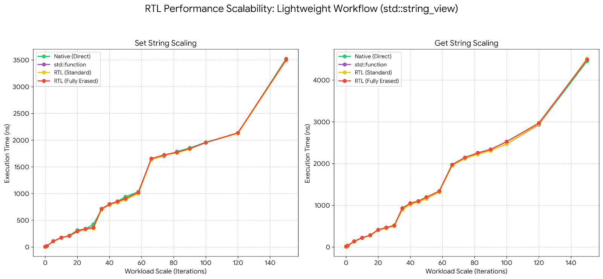
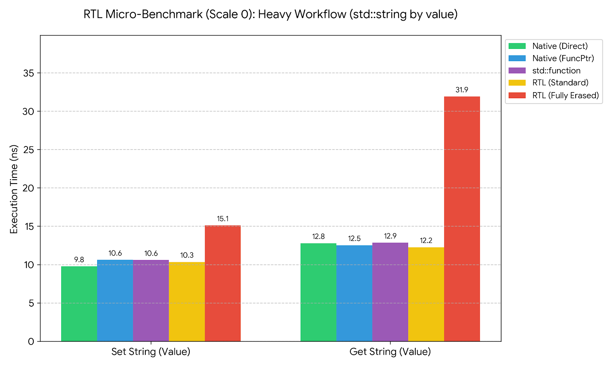
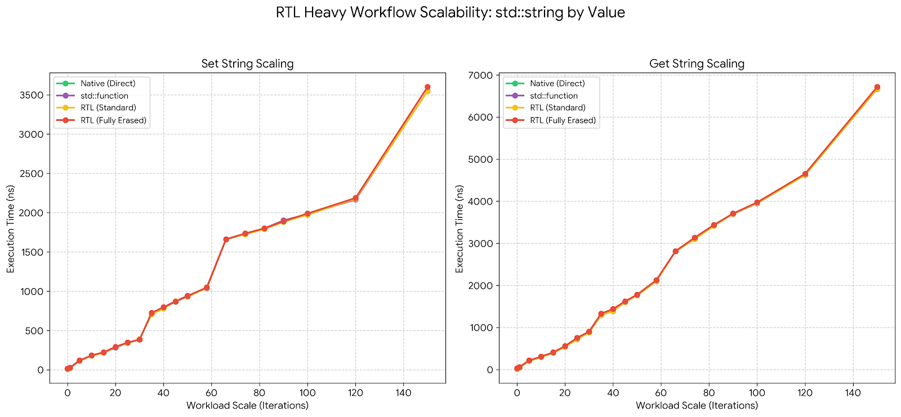

# ⚡ RTL Performance Summary

This document provides a concise, evidence-backed overview of the runtime performance characteristics of **RTL**, derived from systematic microbenchmarking across multiple workload scales, CPU frequencies, and typical real-world C++ usage patterns.

## Benchmark Overview

The benchmark measures the cost of calling functions that perform simple but realistic `string` work. Two variants are evaluated using the types `std::string_view` and `std::string`.

### Lightweight Workflow

The `set`/`get` functions are called via reflection and, RTL’s dispatch layer perfect-forwards the provided arguments to the target call site.

* The input string of length 500 is passed by value as `std::string_view`.
* The function `set(std::string_view)` copies the argument. This copy is very lightweight, as it only contains a pointer and a size.
* The actual work performed is concatenating the passed string into a global `std::string` for a given number of iterations (the workload scale).
* The getter, `std::string_view get(std::string_view)`, follows the same flow, including the argument copy, and returns a `std::string_view` pointing to the globally stored string, which is again a lightweight object.

### Heavy Workflow

The dispatch setup of the heavy workflow is the same, except it uses `std::string` instead of `std::string_view`, which means:

* The input string is passed by value as `std::string` and is copied on every call. Both `set` and `get` perform this copy operation for a 500-character string, typically involving heap allocation.
* Each workload iteration concatenates this 500-character string into the global storage.
* The getter `std::string get(std::string)`, returns a full `std::string` copy of the accumulated global string, which grows in size with the workload and requires heap allocation.

In both cases, the real work is dominated by string concatenation, allocation, and copying.
The benchmarks therefore highlight how different call paths – direct calls, `std::function`, and reflected(`rtl::function`/`rtl::method`) calls behave when meaningful work is present, rather than measuring dispatch overhead in isolation.

Workload scales tested: *0, 1, 5, 10, 15, 20, 25 … up to 150.*

## 🚀 Results with `std::string_view` Workflow

### Dispatch Overhead

***RTL (standard)** refers to typed calls where the target and return types are known at compile time.*

### Scaling Workloads (0 to 150)

### Observations

* `rtl::function` matches or outperforms `std::function`.
* Non-erased RTL calls are effectively zero-overhead.
* Erased return types introduce measurable but bounded overhead.
* Dispatch cost is quickly amortized once real work is present.

## 🧱 Results with `std::string` Workflow

### Dispatch Overhead

### Scaling Workloads (0 to 150)

### Observations

* Getter cost is significantly higher due to return-by-value.
* Memory allocation and copying dominate runtime.
* Reflection overhead becomes negligible in comparison.
* Even fully erased RTL calls remain within ~3–5% of direct calls.

## 📌 Key Insights

* `rtl::function` consistently matches or outperforms `std::function` across all workloads.
* Non-erased RTL calls behave like near-zero-overhead abstractions, comparable to raw function pointers.
* Type erasure introduces overhead, but the cost is bounded and predictable.
* Return-type erasure is more expensive than target-type erasure, especially for `std::string` return values.
* As workload size increases, real work dominates dispatch overhead.
* Memory allocation and string copying become the primary performance costs.
* Reflection does not distort scaling behavior or introduce nonlinear slowdowns.
* The value vs view semantics have a larger performance impact than reflection itself.

## 🖥️ Test Bed

The benchmarks were executed on a Linux x86_64 system in a typical release-style configuration. The details below capture the essential factors needed for reproducibility.

* **OS:** Linux (Kernel `6.12.38+kali-amd64`)
* **Compiler:** Clang++ **21.1.8**
* **C++ Standard:** GNU++20 (`-std=gnu++20`)
* **Optimization:** `-O3 -DNDEBUG`
* **LTO:** disabled (no `-flto`)
* **RTTI / Exceptions:** enabled (defaults)
* **CPU tuning:** generic x86-64 (no `-march=native`)
* **Standard library:** `libstdc++` (system default)

**Hardware (observed):**

* 16 logical cores
* Dynamic frequency scaling (~800 MHz – ~4.8 GHz)

Benchmarks were run multiple times under **low system load** (load average consistently < 1.0, as recorded in logs) to ensure stable and comparable performance trends across workloads.

## 📂 Raw Benchmark Logs

[benchmark_runs_string.log](benchmark_runs_string.log)

[benchmark_runs_string_view.log](benchmark_runs_string_view.log)

These logs contain the full per-scale measurements for all dispatch paths, including multiple runs at different CPU frequencies to validate consistency.
